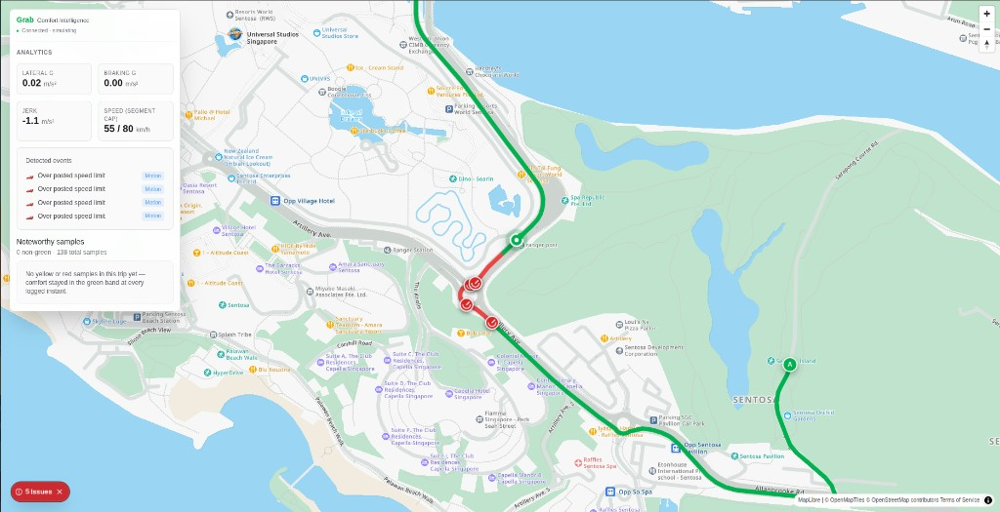
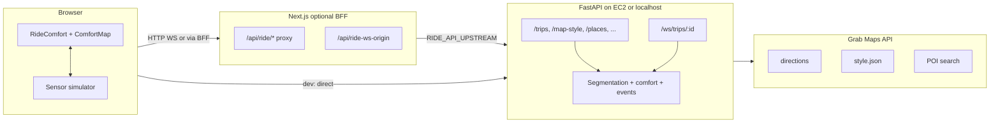

# RoadSense — Comfort-Aware Map Intelligence (Grab Maps API Hackathon)

**Grab knows where a ride happened. This demo shows how it could know how it felt.**

Today, ride quality is often reduced to a single star rating. RoadSense (this project) is a **ride comfort intelligence** prototype: it combines **map-matched route geometry** with **phone-style motion signals** to produce **per-segment comfort bands**, **discrete events** (harsh brake, bump, etc.), and a **0–100 trip comfort score**—with **context labels** (vehicle, road, route, traffic) so not everything is blamed on the driver.

For the hackathon, motion is **simulated in the browser** along real or fixture polylines; the **FastAPI** backend scores samples in real time over **WebSocket** and returns an end-of-trip summary the **Next.js** app renders beside a **MapLibre** map.

### Demo video

**[RoadSense — walkthrough on YouTube](https://www.youtube.com/watch?v=tQkLj4Anrbk)**

### See it during navigation



While the trip runs, issues surface in **three places at once** so you can see *where* and *what* without waiting for the end of the ride:

| Surface | What you see |
|--------|----------------|
| **Map** | The path is drawn **segment by segment** in comfort colors (green → smooth, amber → mild stress, red → elevated roughness). **Markers** appear at the GPS location of each discrete event (e.g. over posted limit, bump). The vehicle position updates along the road. |
| **Analytics** | **Lateral G**, **braking G**, **jerk**, and **speed vs segment speed limit** refresh as samples arrive—speed limits are derived from route curvature on the backend, not a separate traffic feed. |
| **Detected events** | A scrolling list of labeled incidents (with icons) as they fire; a compact **issues** control shows the running count of notable events for the current trip. |

*Note:* Continuous **comfort bands** (green/yellow/red *samples*) and discrete **events** (e.g. speeding) can differ slightly in timing: a segment can turn red from accumulated motion while the “noteworthy samples” list tracks **instant** band crossings—both views are part of the same live stream.

---

## Table of contents

- [Demo video](#demo-video)
- [See it during navigation](#see-it-during-navigation)
- [Product idea](#product-idea)
- [What this repo implements](#what-this-repo-implements)
- [Architecture](#architecture)
- [System layers](#system-layers)
- [Comfort scoring (technical)](#comfort-scoring-technical)
- [API surface](#api-surface)
- [WebSocket protocol](#websocket-protocol)
- [Frontend (map & UI)](#frontend-map--ui)
- [Tech stack](#tech-stack)
- [Configuration](#configuration)
- [Run locally](#run-locally)
- [Deployment](#deployment)
- [Reference docs](#reference-docs)
- [Limitations & product next steps](#limitations--product-next-steps)

---

## Product idea

| Stakeholder | Outcome (vision) | In this demo |
|-------------|------------------|--------------|
| **Riders** | A simple post-trip **comfort score** and **what affected it** | Trip score, textual summary, segment strip, event breakdown |
| **Drivers** | **Fairer feedback**—credit smooth driving; coach when behavior mattered | Events tagged with **attribution** (e.g. bump → road, sharp turn on a bend → route vs vehicle) |
| **Grab / maps** | A **segment-level comfort layer** over the city to inform routing and road insight | **Live** per-segment green / amber / red on the map for each trip; no persistent city-wide aggregate store |

The prototype proves the pipeline: **route → segments → map-matched samples → real-time comfort + events → trip summary**, using **Grab Maps** where configured (directions, style, POI search).

---

## What this repo implements

- **Monorepo**: `apps/web` (Next.js 16+ with App Router, React, Tailwind-style UI in components) and `apps/api` (Python **FastAPI** + **Uvicorn**).
- **Routing**: `POST /trips` loads a driving route as `(lat, lng)` points from:
  - **Grab** `GET …/api/v1/maps/eta/v1/direction` (polyline6) when `GRABMAPS_API_KEY` is set and fixture mode is off, **or**
  - A **checked-in Singapore fixture** when `useFixture: true` or `USE_DIRECTIONS_FIXTURE=1`, **or**
  - **OSRM** public demo router if the user provides O/D but no Grab key, **or** fixture as last resort.
- **Segmentation**: The polyline is split into **road segments** (~55 m target, splits on length or sharp bearing change). Each segment gets **curvature** (mean bearing change per meter) and a **dynamic comfort baseline** derived from that geometry.
- **Map matching**: For each sample, the backend finds the **nearest route segment** (point-to-segment distance in a local equirectangular frame).
- **Live scoring**: **WebSocket** `ws/trips/{id}` ingests `ax, ay, az` (m/s²), GPS, speed; responds with **instant comfort band**, **metrics**, **new events**, and **updated segment GeoJSON** for the map.
- **Client simulation**: The web app **densifies the route**, adds **curvature-aware lateral motion**, noise, and **injected incidents** (deterministic per `tripId`), then streams samples at a fixed interval.
- **Map UI**: **MapLibre** with style from the backend’s **`/map-style`** (proxies Grab `api/style.json` with Bearer) or **Carto Positron** fallback; **data-driven** line colors by segment `comfort` property; markers for **events** and the **vehicle** position.
- **Production-shaped hosting**: Optional **Next.js BFF** (`/api/ride/*`) proxying to a **public FastAPI** URL (e.g. EC2); **`/api/ride-ws-origin`** exposes **`wss://`** for browsers when the API is on a raw IP with TLS issues.
- **CI deploy**: GitHub Action **rsync**s `apps/api` to **EC2**, installs deps, **nginx** + **systemd** (see [Deployment](#deployment)).

---

## Architecture



**Data flow (one trip):**

1. `POST /trips` → decode polyline, build segments, baselines, initial GeoJSON.
2. Client opens `WebSocket` and sends `sample` (or `batch` with `items`) messages.
3. Server updates `segment_comfort`, appends `RideEvent`s, returns `state` + `segment_geojson`.
4. `POST /trips/{id}/complete` → **final_score** (segment blend + event deductions + summary text).

Trips are held **in memory** on the API process (`TRIPS` dict)—suitable for demos, not multi-instance production without a shared store.

---

## System layers

| Layer | Responsibility |
|-------|----------------|
| **Ingestion** | WebSocket JSON samples: `t_ms`, `lat`, `lng`, `ax`, `ay`, `az`, `speed_kmh` |
| **Routing & geometry** | Polyline decode ([`app/grab/polyline.py`](apps/api/app/grab/polyline.py)), segment build ([`app/comfort/segmentation.py`](apps/api/app/comfort/segmentation.py)) |
| **Map matching** | Nearest segment by distance to segment chords ([`app/comfort/geometry.py`](apps/api/app/comfort/geometry.py)) |
| **Baselines** | Per-segment limits for lateral accel, braking, jerk, vertical spike, and a **curvature-based speed cap proxy** ([`app/comfort/baseline.py`](apps/api/app/comfort/baseline.py)) |
| **Continuous comfort** | Ratios of |lateral|, braking, |jerk| vs baseline → `green` / `yellow` / `red` ([`app/comfort/trip.py`](apps/api/app/comfort/trip.py)) |
| **Discrete events** | Thresholds for harsh brake/accel, uneven accel (jerk), sharp turn, bump (`|az - g|`), speeding vs segment limit ([`app/comfort/events.py`](apps/api/app/comfort/events.py)) |
| **Attribution** | Heuristic **vehicle** vs **road** vs **route** vs **traffic** on select events to separate context (not assigning blame to a person) |
| **Aggregation** | Worst comfort per segment over time; **final score** combines segment red/yellow fraction with capped **event impact** list |
| **Presentation** | GeoJSON `FeatureCollection` of segment `LineString`s; MapLibre `match` expression for line color; side panel metrics and end-of-trip cards |

---

## Comfort scoring (technical)

- **Per-sample band**: Compare lateral acceleration (`ay`), braking demand (`max(0,-ax)`), and longitudinal jerk to the **segment baseline**; take the max normalized stress and map to three bands (thresholds at ~0.9 / 1.15 of baseline).
- **Events** (with cooldowns per type per segment): e.g. harsh brake/accel, uneven accel, sharp lateral, vertical bump, speeding / risky-speeding while turning. Events also **bump the segment’s stored band** (bumps cap at yellow; most others can push red).
- **Final score** (see `final_score` in [`trip.py`](apps/api/app/comfort/trip.py)):
  - **Segment part**: `100 - 22×(red share) - 8×(yellow share)` (normalized by segment count).
  - **Event part**: sum of per-type **impact weights**, capped, subtracted from 100.
  - Result is **`min(segment_score, event_score)`**, floored to one decimal, clamped 0–100.
- **Summary strings** combine segment mix (roughness) and counts of speed/accel-related events.

---

## API surface

| Method & path | Purpose |
|---------------|---------|
| `GET /health` | Liveness, version, whether Grab env looks configured, fixture flag |
| `GET /map-style` | Proxies Grab **`/api/style.json`** (requires server `GRABMAPS_API_KEY`) |
| `GET /places/search?q=` | Singapore-biased search: **Grab POI** if key set, else **Nominatim** (SG) |
| `POST /trips` | Body: optional `useFixture`, `origin`/`destination` → `{ trip_id, path_lat_lng, geojson, baselines, routing_mode, … }` |
| `GET /trips/{trip_id}` | Current GeoJSON, `segment_colors`, `events` |
| `POST /trips/{trip_id}/complete` | End-of-trip `score`, `summary`, `per_segment`, `event_counts`, `stats`, `events` |
| `WebSocket /ws/trips/{trip_id}` | Bidirectional stream (see below) |

---

## WebSocket protocol

**Client → server**

- `{ "type": "ping" }` → server `{ "type": "pong" }`
- `{ "type": "sample", "t_ms", "lat", "lng", "ax", "ay", "az", "speed_kmh" }`
- `{ "type": "batch", "items": [ { ... same fields per item ... } ] }` (server applies last item for ack shape in current implementation)

**Server → client** (for `sample` / end of `batch`):

- `type: "state"`, `comfort`, `in_range` (not red), `current_segment`, `position` (incl. `heading_deg`), `metrics`, `baselines` (for current segment), `new_events`, `segment_colors`, `segment_geojson`

---

## Frontend (map & UI)

Screenshot and explanation of how **errors and events** show up on the map and in the side panel during a trip: [See it during navigation](#see-it-during-navigation).

- **[`apps/web/components/RideComfort.tsx`](apps/web/components/RideComfort.tsx)** — Trip phases (`idle` → `running` → `done`), place search (`SingaporePlaceField`), start trip, WebSocket client, **motion simulator** along returned path, live metrics, **“Noteworthy samples”** stream, completion UI (score, segment bar, event breakdown, attributed event lists).
- **[`apps/web/components/ComfortMap.tsx`](apps/web/components/ComfortMap.tsx)** — MapLibre map, `route-comfort` GeoJSON line layer, event markers, optional plan/route pins, `transformRequest` Bearer for Grab tiles when using Grab style.
- **[`apps/web/lib/config.ts`](apps/web/lib/config.ts)** — `getApiUrl()`, `getBackendWsBase()` (BFF + `ride-ws-origin`), https upgrade rules for secure pages, **bare public IP** → force same-origin proxy.

---

## Tech stack

| Area | Choices |
|------|---------|
| **Web** | Next.js (App Router), React, TypeScript, MapLibre GL |
| **API** | Python 3.11+, FastAPI, Uvicorn, httpx, Pydantic v2, pydantic-settings |
| **Package / env** | Root `package.json` workspaces; API managed with **uv** ([`pyproject.toml`](apps/api/pyproject.toml)) or `pip` + [`requirements.txt`](apps/api/requirements.txt) |
| **Maps** | Grab Maps HTTP API (directions, style, POI); OSRM / fixture / Nominatim fallbacks |
| **Ops** | GitHub Actions → EC2 (rsync, nginx, systemd), optional Vercel + `RIDE_API_UPSTREAM` |

---

## Configuration

Authoritative **Grab gateway** behavior (paths, `lng,lat` order, Bearer auth, style URL) is documented in [`SKILL.md`](SKILL.md).

1. Copy [`.env.example`](.env.example) to **`.env`** at the monorepo root (and optionally mirror into `apps/web/.env.local` for Next).
2. Set at minimum:
   - **`GRABMAPS_API_KEY`** — server-side direction/style/POI (optional but recommended for full demo).
   - **`NEXT_PUBLIC_GRABMAPS_API_KEY`** / **`NEXT_PUBLIC_GRABMAPS_BASE_URL`** — if the client ever needs the public key (map uses backend `/map-style` for style).
   - **`NEXT_PUBLIC_API_URL`**, **`NEXT_PUBLIC_WS_URL`** — local dev defaults to `http://127.0.0.1:8000` and `ws://127.0.0.1:8000`.
3. **`USE_DIRECTIONS_FIXTURE=1`** — forces the canned Singapore polyline in [`route_fixture.json`](apps/api/app/grab/fixtures/route_fixture.json) without calling directions.
4. **Hosted Next + remote API**: set server-only **`RIDE_API_UPSTREAM`** (or `BACKEND_URL`) to your FastAPI base URL; use **`RIDE_API_TLS_INSECURE=1`** only if the upstream uses a self-signed cert (server-side fetch). Client may use **`NEXT_PUBLIC_RIDE_VIA_BFF=1`** with localhost to test the proxy.

Default demo O/D in config (when not passing coordinates): **Changi T3** → **Grab HQ (one-north)** ([`app/config.py`](apps/api/app/config.py)).

---

## Run locally

**Prerequisites:** Node.js 20+, Python 3.11+ (with [uv](https://github.com/astral-sh/uv) recommended).

From the repo root, create `.env` (see [Configuration](#configuration)). You can `cp .env apps/web/.env.local` if Next should load the same variables.

**Terminal 1 — API (port 8000)**

```bash
cd apps/api && uv sync && uv run uvicorn app.main:app --reload --host 127.0.0.1 --port 8000
```

**Without uv:**

```bash
cd apps/api && python3 -m venv .venv && . .venv/bin/activate && pip install -r requirements.txt && \
  USE_DIRECTIONS_FIXTURE=1 PYTHONPATH=. uvicorn app.main:app --reload --host 127.0.0.1 --port 8000
```

**Terminal 2 — Web (port 3000)**

```bash
npm install
npm run dev:web
```

Open [http://127.0.0.1:3000](http://127.0.0.1:3000).

**Root scripts** ([`package.json`](package.json)):

- `npm run dev:web` — Next dev server
- `npm run dev:api` — Uvicorn for `apps/api`
- `npm run build:web` — production build of `apps/web`

---

## Deployment

- **API (EC2)**: [`.github/workflows/deploy-api-ec2.yml`](.github/workflows/deploy-api-ec2.yml) syncs `apps/api` and `deploy/ec2/`, creates venv, installs packages, installs **nginx** site + **systemd** unit, restarts services. Server env for Grab keys is expected via **`/etc/ride-comfort.env`** or your host setup (not committed).
- **Web**: Can run on Vercel or any Node host; point **`RIDE_API_UPSTREAM`** at the public FastAPI `https` origin so the browser uses **same-origin** `/api/ride` and avoids mixed content / self-signed IP issues.
- **TLS**: Repo includes [`deploy/ec2/letsencrypt-bootstrap.sh`](deploy/ec2/letsencrypt-bootstrap.sh) for Let’s Encrypt; workflow notes that nginx may be reset to a template until TLS is re-applied.

---

## Reference docs

- [`SKILL.md`](SKILL.md) — Grab Maps API usage, style fetch, direction coordinates.
- [`CLAUDE.md`](CLAUDE.md) — project coding guidelines for contributors.

---

## Limitations & product next steps

**Current scope (honest):**

- **No persistent store** for trips or aggregate segment statistics—each API process is stateless across restarts.
- **Map matching** is geometric nearest-segment, not a full HMM / map-matching service.
- **Baselines and thresholds** are **heuristics** tuned for the simulator, not calibrated on production phone data.
- **“Traffic”** attribution is a simple signal (e.g. straight road harsh brake); there is no live traffic API fused in.
- **Gyroscope** is not a separate input; **road surface** is inferred from vertical accel spikes and event labels, not a physical road roughness model.

**Natural extensions for a production RoadSense layer:**

- Store **segment aggregates** (count, mean comfort, percentiles) in a **tile or database** and blend with OSM road class.
- On-device **sensor fusion** and **privacy**-preserving upload policies.
- **Driver/rider** surfaces as separate app screens with coaching UX tied to **vehicle-attributed** events only.
- **A/B** comfort-aware routing using segment priors.

---

*Grab Maps API Hackathon — Grab Maps + Next.js + FastAPI — RoadSense: measurable comfort on the map.*
